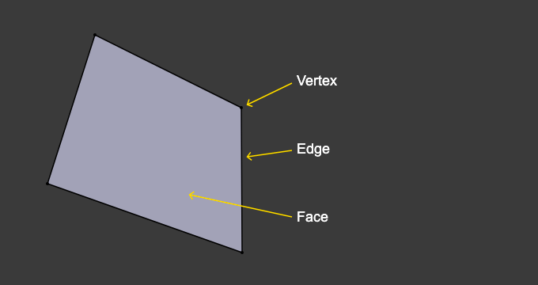

# Modeling
创建一个3d场景需要3个关键组件，Models、Materials 和 Light。

## Edit Mode
Edit Mode在建模中的核心。Edit Mode用于修改以下对象：
1. Meshes
2. Curves
3. Surfaces
4. Metaballs
5. Text Object 
6. Lattice

# 1.Meshes
Mesh 模型起源于网格模型，使用这个我们可以创建更大、更复杂的图形。

## Modeling Modes
3D Viewport  有3个模型是允许被创建、编辑、操纵。

1. Object Mode  
支持基本操纵，如对象创建、对象连接、图形点管理、UV/color layer
   
2. Edit Mode  
   Used for the majority of mesh editing operations.

3. Sculpt Mode
   Instead of dealing with individual mesh elements, supports sculpting with brushes (not covered in this chapter).

## 结构
对于Meshes而言，所有的事物都是基于 vertices（点）、Edge（线/边）和 Face（面）构成的。

