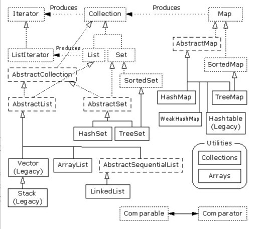

# 2022-09-14 DAY01

## Q：在java7中可以作为switch的参数的类型有哪些？

switch语句后的控制表达式只能是short、char、int、long整数类型和枚举类型，不能是float，double和boolean类型。**String类型是java7开始支持。**

## Q:java中set，list的继承和实现体系？

注：虚线矩形框代表接口，实现矩形框代表实现类；

## Q:java的体系结构包括：
1. java编程语言
2. java类文件格式
3. java api

