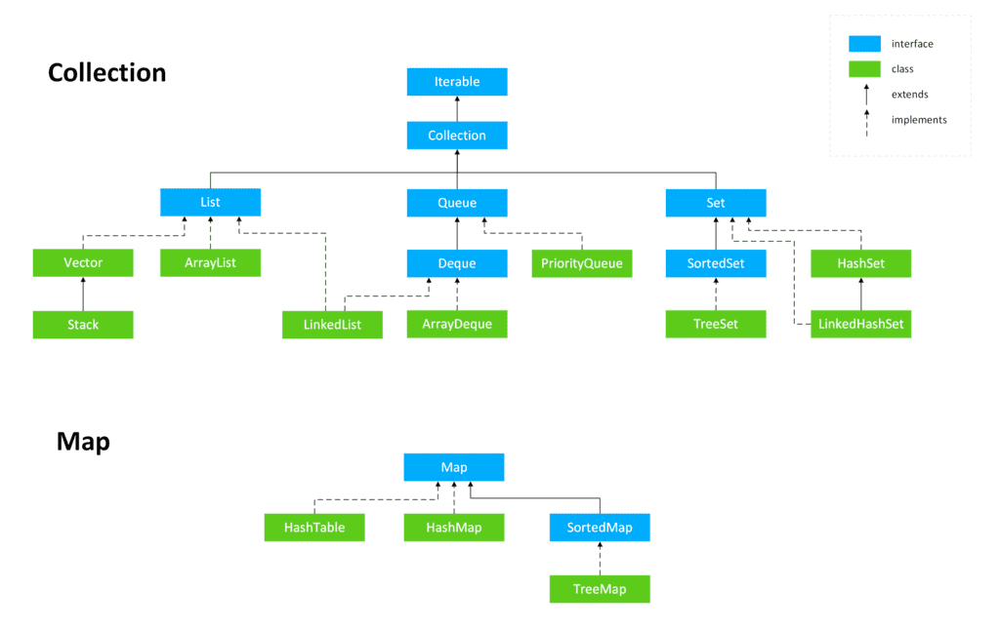

# JAVA集合常见问题

## java集合概述

java集合，也叫做容器。由两大接口派生而来：一个是Collection，主要用于存放单一元素。另一个是Map，主要用于存储键值对。

## 说说List，Set，Queue，Map的区别

+ List（对付顺序的好帮手）：存储的元素是有序的、可重复的。
+ Set（注重独一无二的性质）：存储的元素是无序的、不可重复的。
+ Queue (实现排队功能的叫号机)：按特定的排队规则来确定先后顺序，存储的元素是有序的，可重复的。
+ Map （用key搜索的专家）：使用key——value存储。key是无序的、不可重复的。value是无序的、可重复的、每个键最多映射到一个值。

## 集合框架底层数据结构总结

### List

+ ArrayList：Object[]数组
+ Vector:Object[]数组
+ LinkedList：双向链表（1.6 之前是双向循环链表，1.7之后取消了循环）

### Set

+ HashSet (无序，唯一)：基于HashMap实现的，底层采用HashMap来保存元素。
+ LinkedHashSet：LinkedHashSet是HashSet的子类，并且其内部是通过LinkedHashMap来实现的。有点类似于我们之前说的LinkedHashMap其内部是基于HashMap实现一样，但还是有点区别。
+ TreeSet（有序，唯一）红黑树（自平衡的排序二叉树）

### Queue

+ PriorityQueue: Object[] 数组实现二叉堆
+ ArrayQueue： Object[] 数组+双指针

### Map

+ HashMap: JDK1.8 之前 HashMap 由数组+链表组成的，数组是 HashMap 的主体，链表则是主要为了解决哈希冲突而存在的（“拉链法”解决冲突）。JDK1.8
  以后在解决哈希冲突时有了较大的变化，当链表长度大于阈值（默认为 8）（将链表转换成红黑树前会判断，如果当前数组的长度小于 64，那么会选择先进行数组扩容，而不是转换为红黑树）时，将链表转化为红黑树，以减少搜索时间

+ LinkedHashMap： LinkedHashMap 继承自 HashMap，所以它的底层仍然是基于拉链式散列结构即由数组和链表或红黑树组成。另外，LinkedHashMap
  在上面结构的基础上，增加了一条双向链表，使得上面的结构可以保持键值对的插入顺序。同时通过对链表进行相应的操作，实现了访问顺序相关逻辑。相关详情可见：[连接]( https://www.imooc.com/article/22931 )

+ Hashtable: 数组+链表组成的，数组是 Hashtable 的主体，链表则是主要为了解决哈希冲突而存在的

+ TreeMap:红黑树（自平衡的排序二叉树）

## 如何选用集合？

主要根据集合的特点来选用，比如我们需要根据键值获取到元素值时就选用 Map 接口下的集合，需要排序时选择 TreeMap,不需要排序时就选择 HashMap,需要保证线程安全就选用 ConcurrentHashMap。

当我们只需要存放元素值时，就选择实现Collection 接口的集合，需要保证元素唯一时选择实现 Set 接口的集合比如 TreeSet 或 HashSet，不需要就选择实现 List 接口的比如 ArrayList 或
LinkedList，然后再根据实现这些接口的集合的特点来选用。

## 为什么要使用集合

当我们需要保存一组类型相同的数据的时候，我们应该是用一个容器来保存，这个容器就是数组，但是，使用数组存储对象具有一定的弊端， 因为我们在实际开发中，存储的数据的类型是多种多样的，于是，就出现了“集合”，集合同样也是用来存储多个数据的。

数组的缺点是一旦声明之后，长度就不可变了；同时，声明数组时的数据类型也决定了该数组存储的数据的类型；而且，数组存储的数据是有序的、可重复的，特点单一。 但是集合提高了数据存储的灵活性，Java
集合不仅可以用来存储不同类型不同数量的对象，还可以保存具有映射关系的数据。

## Connection 子接口之List

### Arraylist和Vector的区别？

+ ArrayList是List的主要实现类，底层使用Object[]存储，适用于频繁的查找工作，线程不安全。
+ Vector 是List的古老实现类，底层使用Object[] 存储，线程安全的。

### Arraylist 与 LinkedList区别？

+ 是否保证线程安全：ArrayList 和 LinkedList 都是不同步的，也就是不保证线程安全；
+ 底层数据结构： Arraylist 底层使用的是 Object 数组；LinkedList 底层使用的是 双向链表 数据结构（JDK1.6 之前为循环链表，JDK1.7 取消了循环。注意双向链表和双向循环链表的区别，下面有介绍到！）
+ 插入和删除是否受元素位置的影响：
    1. ArrayList 采用数组存储，所以插入和删除元素的时间复杂度受元素位置的影响。 比如：执行add(E e)方法的时候， ArrayList 会默认在将指定的元素追加到此列表的末尾，这种情况时间复杂度就是 O(1)
       。但是如果要在指定位置 i 插入和删除元素的话（add(int index, E element)）时间复杂度就为 O(n-i)。因为在进行上述操作的时候集合中第 i 和第 i 个元素之后的(n-i)
       个元素都要执行向后位/向前移一位的操作。
    2. LinkedList 采用链表存储，所以，如果是在头尾插入或者删除元素不受元素位置的影响（add(E e)、addFirst(E e)、addLast(E e)、removeFirst() 、 removeLast()
       ），时间复杂度为 O(1)，如果是要在指定位置 i 插入和删除元素的话（add(int index, E element)，remove(Object o)）， 时间复杂度为 O(n) ，因为需要先移动到指定位置再插入。

+ 是否支持快速随机访问： LinkedList 不支持高效的随机元素访问，而 ArrayList 支持。快速随机访问就是通过元素的序号快速获取元素对象(对应于get(int index)方法)。
+ 内存空间占用： ArrayList 的空 间浪费主要体现在在 list 列表的结尾会预留一定的容量空间，而 LinkedList 的空间花费则体现在它的每一个元素都需要消耗比 ArrayList
  更多的空间（因为要存放直接后继和直接前驱以及数据）。

### list的扩容机制
[ArrayList扩容机制]( https://javaguide.cn/java/collection/arraylist-source-code.html#_3-2-%E4%B8%80%E6%AD%A5%E4%B8%80%E6%AD%A5%E5%88%86%E6%9E%90-arraylist-%E6%89%A9%E5%AE%B9%E6%9C%BA%E5%88%B6 )

## Collection 子接口之Set
### comparable 和 comparator 的区别：
+ comparable 接口实际上是出自java.lang包 它有一个 compareTo(Object obj)方法用来排序
+ comparator接口实际上是出自 java.util 包它有一个compare(Object obj1, Object obj2)方法用来排序 
  
一般我们需要对一个集合使用自定义排序时，我们就要重写compareTo()方法或compare()方法，当我们需要对某一个集合实现两种排序方式，比如一个 song 对象中的歌名和歌手名分别采用一种排序方法的话，我们可以重写compareTo()方法和使用自制的Comparator方法或者以两个 Comparator 来实现歌名排序和歌星名排序，第二种代表我们只能使用两个参数版的 Collections.sort().

### 比较 HashSet、LinkedHashSet 和 TreeSet 三者的异同
+ HashSet、LinkedHashSet 和 TreeSet 都是 Set 接口的实现类，都能保证元素唯一，并且都不是线程安全的。
+ HashSet、LinkedHashSet 和 TreeSet 的主要区别在于底层数据结构不同。HashSet 的底层数据结构是哈希表（基于 HashMap 实现）。LinkedHashSet 的底层数据结构是链表和哈希表，元素的插入和取出顺序满足 FIFO。TreeSet 底层数据结构是红黑树，元素是有序的，排序的方式有自然排序和定制排序。
+ 底层数据结构不同又导致这三者的应用场景不同。HashSet 用于不需要保证元素插入和取出顺序的场景，LinkedHashSet 用于保证元素的插入和取出顺序满足 FIFO 的场景，TreeSet 用于支持对元素自定义排序规则的场景。

### Queue 与 Deque 的区别

`Queue` 是单端队列，只能从一端插入元素，另一端删除元素，实现上一般遵循 **先进先出（FIFO）** 规则。

`Queue` 扩展了 `Collection` 的接口，根据 **因为容量问题而导致操作失败后处理方式的不同** 可以分为两类方法: 一种在操作失败后会抛出异常，另一种则会返回特殊值。

| `Queue` 接口 | 抛出异常  | 返回特殊值 |
| ------------ | --------- | ---------- |
| 插入队尾     | add(E e)  | offer(E e) |
| 删除队首     | remove()  | poll()     |
| 查询队首元素 | element() | peek()     |

`Deque` 是双端队列，在队列的两端均可以插入或删除元素。

`Deque` 扩展了 `Queue` 的接口, 增加了在队首和队尾进行插入和删除的方法，同样根据失败后处理方式的不同分为两类：

| `Deque` 接口 | 抛出异常      | 返回特殊值      |
| ------------ | ------------- | --------------- |
| 插入队首     | addFirst(E e) | offerFirst(E e) |
| 插入队尾     | addLast(E e)  | offerLast(E e)  |
| 删除队首     | removeFirst() | pollFirst()     |
| 删除队尾     | removeLast()  | pollLast()      |
| 查询队首元素 | getFirst()    | peekFirst()     |
| 查询队尾元素 | getLast()     | peekLast()      |

事实上，`Deque` 还提供有 `push()` 和 `pop()` 等其他方法，可用于模拟栈。

### ArrayDeque 与 LinkedList 的区别

`ArrayDeque` 和 `LinkedList` 都实现了 `Deque` 接口，两者都具有队列的功能，但两者有什么区别呢？

- `ArrayDeque` 是基于可变长的数组和双指针来实现，而 `LinkedList` 则通过链表来实现。

- `ArrayDeque` 不支持存储 `NULL` 数据，但 `LinkedList` 支持。

- `ArrayDeque` 是在 JDK1.6 才被引入的，而`LinkedList` 早在 JDK1.2 时就已经存在。

- `ArrayDeque` 插入时可能存在扩容过程, 不过均摊后的插入操作依然为 O(1)。虽然 `LinkedList` 不需要扩容，但是每次插入数据时均需要申请新的堆空间，均摊性能相比更慢。

从性能的角度上，选用 `ArrayDeque` 来实现队列要比 `LinkedList` 更好。此外，`ArrayDeque` 也可以用于实现栈。

### 说一说 PriorityQueue

`PriorityQueue` 是在 JDK1.5 中被引入的, 其与 `Queue` 的区别在于元素出队顺序是与优先级相关的，即总是优先级最高的元素先出队。

这里列举其相关的一些要点：

- `PriorityQueue` 利用了二叉堆的数据结构来实现的，底层使用可变长的数组来存储数据
- `PriorityQueue` 通过堆元素的上浮和下沉，实现了在 O(logn) 的时间复杂度内插入元素和删除堆顶元素。
- `PriorityQueue` 是非线程安全的，且不支持存储 `NULL` 和 `non-comparable` 的对象。
- `PriorityQueue` 默认是小顶堆，但可以接收一个 `Comparator` 作为构造参数，从而来自定义元素优先级的先后。

`PriorityQueue` 在面试中可能更多的会出现在手撕算法的时候，典型例题包括堆排序、求第K大的数、带权图的遍历等，所以需要会熟练使用才行。
