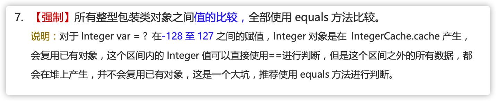
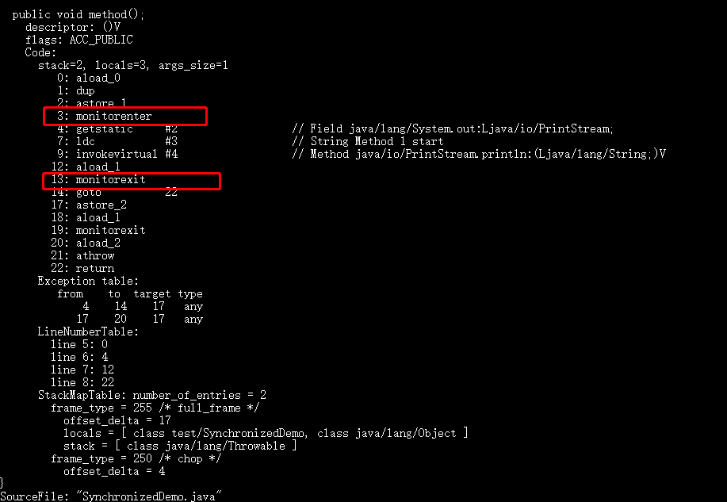
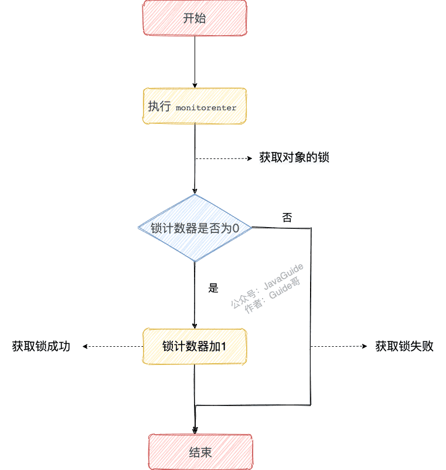
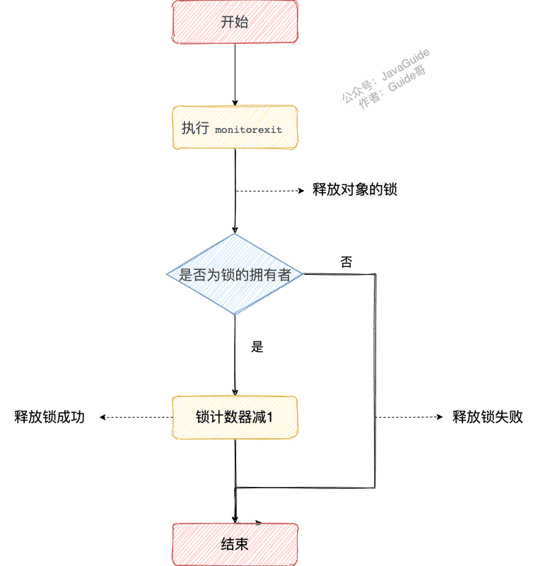
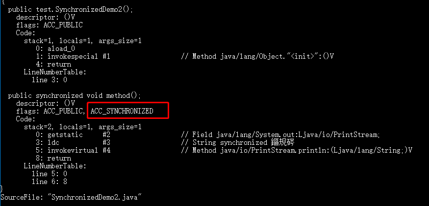
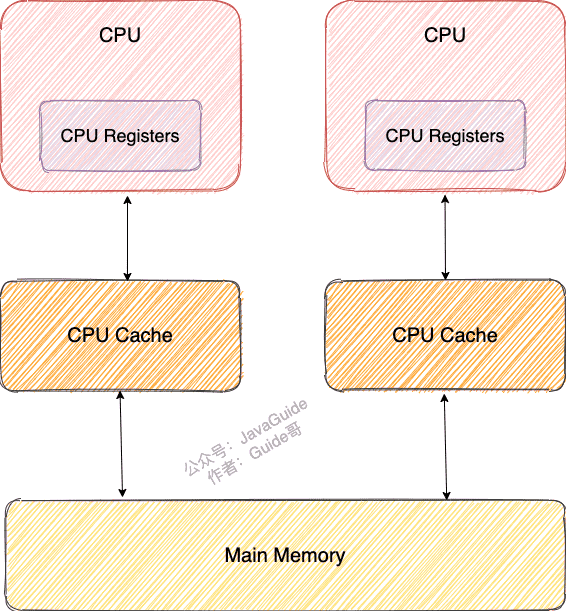
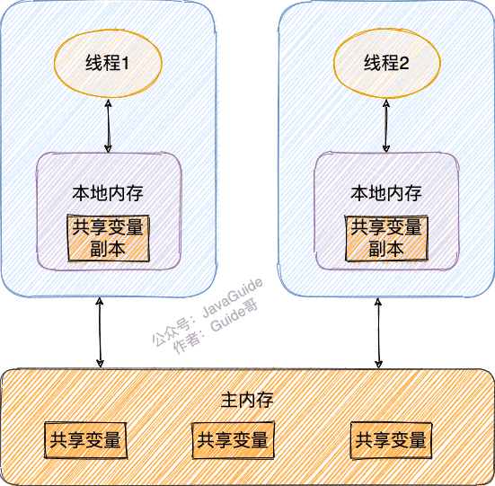
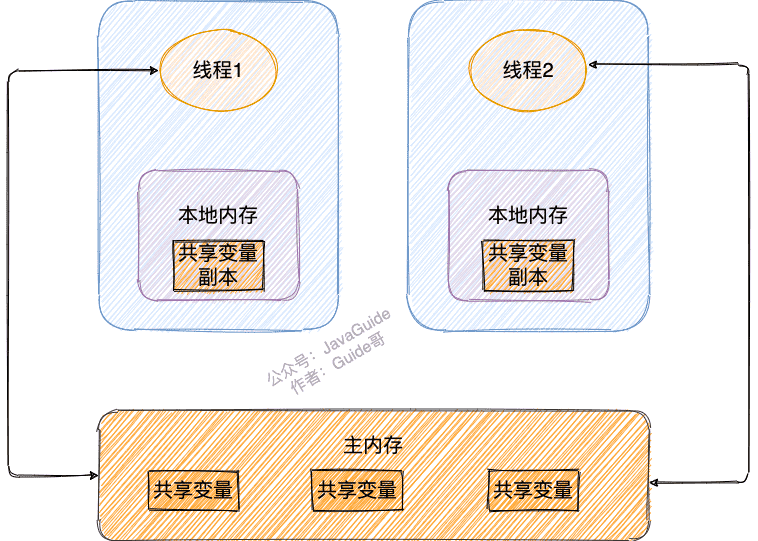

# 我整理的JAVA
## 基本类型和包装类型的区别？
+ 成员变量包装类型不赋值就是 null ，而基本类型有默认值且不是 null。
+ 包装类型可用于泛型，而基本类型不可以。
+ 基本数据类型的局部变量存放在 Java 虚拟机栈中的局部变量表中，基本数据类型的成员变量（未被 static 修饰 ）存放在 Java 虚拟机的堆中。包装类型属于对象类型，我们知道几乎所有对象实例都存在于堆中。
+ 相比于对象类型， 基本数据类型占用的空间非常小。

## 包装类型的缓存机制了解吗？
java基本数据类型的包装类型的大部分都用到了缓存机制来提升性能。但是不是所有。  

Byte,Short,Integer,Long 这 4 种包装类默认创建了数值 [-128，127] 的相应类型的缓存数据，Character 创建了数值在 [0,127] 范围的缓存数据，Boolean 直接返回 True or False。  
如果超出对应范围仍然会去创建新的对象，缓存的范围区间的大小只是在性能和资源之间权衡。    
两种浮点数类型的包装类 Float，Double 并没有实现缓存机制。
```java
Integer i1 = 33;
Integer i2 = 33;
System.out.println(i1 == i2);// 输出 true

Float i11 = 333f;
Float i22 = 333f;
System.out.println(i11 == i22);// 输出 false

Double i3 = 1.2;
Double i4 = 1.2;
System.out.println(i3 == i4);// 输出 false
```
再看一下下面的结果： 
```java
Integer i1 = 40;
Integer i2 = new Integer(40);
System.out.println(i1==i2);
```
Integer i1 = 40 这一行代码会发生装箱，也就是说这行代码等价于 Integer i1 = Integer.valueOf(40)。
因此，i1直接使用的是缓存中的对象。而Integer i2 = new Integer(40) 会直接创建新的对象。



## 自动装箱与拆箱了解吗？原理是什么？
+ 什么是自动拆装箱？
    + 装箱： 将基本类型用它们对应的引用类型包装起来
    + 拆箱： 将包装类型转换为基本数据类型。
    
+ 举例：
    ```java
    Integer i = 10;  //装箱
    int n = i;   //拆箱
    ```
    上面这两行代码对应的字节码为：
    ```
    L1

    LINENUMBER 8 L1

    ALOAD 0

    BIPUSH 10

    INVOKESTATIC java/lang/Integer.valueOf (I)Ljava/lang/Integer;

    PUTFIELD AutoBoxTest.i : Ljava/lang/Integer;

    L2

    LINENUMBER 9 L2

    ALOAD 0

    ALOAD 0

    GETFIELD AutoBoxTest.i : Ljava/lang/Integer;

    INVOKEVIRTUAL java/lang/Integer.intValue ()I

    PUTFIELD AutoBoxTest.n : I

    RETURN
    ```
  从字节码中，我们发现装箱其实就是调用了 包装类的valueOf()方法，拆箱其实就是调用了 xxxValue()方法。  
  因此，  
  Integer i = 10 等价于 Integer i = Integer.valueOf(10)  
  int n = i 等价于 int n = i.intValue();

  注意：如果频繁拆装箱的话，也会严重影响系统的性能。我们应该尽量避免不必要的拆装箱操作。

## 对象的相等和引用相等的区别
+ 对象的相等一般比较的是内存中存放的内容是否相等。
+ 引用相等一般比较的是它们指向的内存地址是否相等。

## 借口和抽象类有什么共同点和区别？
共同点:  
+ 都不能被实例化。
+ 都可以包含抽象方法。
+ 都可以有默认实现的方法（Java 8 可以用 default 关键在接口中定义默认方法）。   
  
区别:  
+ 接口主要用于对类的行为进行约束，你实现了某个接口就具有了对应的行为。抽象类主要用于代码复用，强调的是所属关系（比如说我们抽象了一个发送短信的抽象类，）。
+ 一个类只能继承一个类，但是可以实现多个接口。
+ 接口中的成员变量只能是 public static final 类型的，不能被修改且必须有初始值，而抽象类的成员变量默认 default，可在子类中被重新定义，也可被重新赋值。

## 深拷贝和浅拷贝区别了解吗？什么是引用拷贝？
关于深拷贝和浅拷贝区别，我这里先给结论：
+ 浅拷贝：  
  浅拷贝会在堆上创建一个新的对象（区别于引用拷贝的一点），不过，如果原对象内部的属性是引用类型的话，浅拷贝会直接复制内部对象的引用地址，也就是说拷贝对象和原对象共用同一个内部对象。
+ 深拷贝 ：  
  深拷贝会完全复制整个对象，包括这个对象所包含的内部对象。
  
---
## 说说 `sleep()` 和 `wait()` 方法的区别和共同点
- 两者最主要的区别在于：`sleep()` 方法没有释放锁，而 `wait()` 方法释放了锁 。
- `wait()` 通常被用于线程间交互/通信，`sleep()` 通常被用于暂停执行。
- `wait()` 方法被调用后，线程不会自动苏醒，需要别的线程调用同一个对象上的 `notify()` 或者 `notifyAll()` 方法。`sleep()` 方法执行完成后，线程会自动苏醒。或者可以使用 `wait(long timeout)` 超时后线程会自动苏醒。
- 两者都可以暂停线程的执行。

_**疑问：sleep() 方法是否有无参的？？？**_


---
## 为什么我们调用 start() 方法时会执行 run() 方法，为什么我们不能直接调用 run() 方法？
new 一个 Thread，线程进入了新建状态。调用 `start()`方法，会启动一个线程并使线程进入了就绪状态，当分配到时间片后就可以开始运行了。 `start()` 会执行线程的相应准备工作，然后自动执行 `run()` 方法的内容，这是真正的多线程工作。 但是，直接执行 `run() `方法，会把 `run()` 方法当成一个 main 线程下的普通方法去执行，并不会在某个线程中执行它，所以这并不是多线程工作。

总结： 调用 `start()` 方法方可启动线程并使线程进入就绪状态，直接执行 `run()` 方法的话不会以多线程的方式执行。


---
## synchronized 关键字
### 说一说自己对于synchroized 关键字的理解
`synchronized` 关键字解决的是多个线程之间访问资源的同步性，`synchronized`关键字可以保证被它修饰的方法或者代码块在任意时刻只能有一个线程执行。

另外，在 Java 早期版本中，`synchronized` 属于 `重量级锁`，效率低下。

### 为什么说是`重量级锁`
因为监视器锁（monitor）是依赖于底层的操作系统的 `Mutex Lock` 来实现的，Java 的线程是映射到操作系统的原生线程之上的。如果要挂起或者唤醒一个线程，都需要操作系统帮忙完成，而操作系统实现线程之间的切换时需要从用户态转换到内核态，这个状态之间的转换需要相对比较长的时间，时间成本相对较高。

庆幸的是在 Java 6 之后 Java 官方对从 JVM 层面对 `synchronized` 较大优化，所以现在的 `synchronized` 锁效率也优化得很不错了。JDK1.6 对锁的实现引入了大量的优化，如自旋锁、适应性自旋锁、锁消除、锁粗化、偏向锁、轻量级锁等技术来减少锁操作的开销。

所以，你会发现目前的话，不论是各种开源框架还是 JDK 源码都大量使用了 `synchronized` 关键字。


### 说说自己是怎么使用 synchronized 关键字
synchronized 关键字最主要的三种使用方式：
1. **修饰实例方法：**
   
作用于当前对象实例加锁，进入同步代码前要获得 **当前对象的锁**
```java
synchroized void method(){
    //业务代码
        }
```
2. **修饰静态方法：**
   
也就是给当前类加锁，会作用于类的所有对象实例 ，进入同步代码前要获得 当前 class 的锁。因为静态成员不属于任何一个实例对象，是类成员（ static 表明这是该类的一个静态资源，不管 new 了多少个对象，只有一份）。所以，如果一个线程 A 调用一个实例对象的非静态 synchronized 方法，而线程 B 需要调用这个实例对象所属类的静态 synchronized 方法，是允许的，不会发生互斥现象，因为访问静态 synchronized 方法占用的锁是当前类的锁，而访问非静态 synchronized 方法占用的锁是当前实例对象锁。
```java

synchronized static void method() {
    //业务代码
}

```
3. **修饰代码块**
   
指定加锁对象，对给定对象/类加锁。synchronized(this|object) 表示进入同步代码库前要获得给定对象的锁。synchronized(类.class) 表示进入同步代码前要获得 当前 class 的锁
   
```java
synchronized(this) {
    //业务代码
}
```
**总结：**
- `synchronized` 关键字加到 `static` 静态方法和 `synchronized(class)` 代码块上都是是给 Class 类上锁。
- `synchronized` 关键字加到实例方法上是给对象实例上锁。
- 尽量不要使用 `synchronized(String a)` 因为 JVM 中，字符串常量池具有缓存功能！

---
## 构造方法可以使用synchronized关键字修饰吗？
**构造方法不能使用synchronized关键字修饰**  
构造方法本身就是线程安全的，不存在同步构造方法一说。

## 讲一下synchronized关键字的底层原理
synchronized 关键字底层原理属于JVM层面。
### synchronized 同步语句块的情况

```java
public class SynchronizedDemo {
    public void method() {
        synchronized (this) {
            System.out.println("synchronized 代码块");
        }
    }
}
```
通过 JDK 自带的 javap 命令查看 SynchronizedDemo 类的相关字节码信息：首先切换到类的对应目录执行 javac SynchronizedDemo.java 命令生成编译后的 .class 文件，  
然后执行javap -c -s -v -l SynchronizedDemo.class。


从上面我们可以看出：synchronized 同步语句块的实现使用的是 monitorenter 和 monitorexit 指令，其中 monitorenter 指令指向同步代码块的开始位置，monitorexit 指令则指明同步代码块的结束位置。  

在执行monitorenter时，会尝试获取对象的锁，如果锁的计数器为 0 则表示锁可以被获取，获取后将锁计数器设为 1 也就是加 1。


对象锁的的拥有者线程才可以执行 monitorexit 指令来释放锁。在执行 monitorexit 指令后，将锁计数器设为 0，表明锁被释放，其他线程可以尝试获取锁。  

  
如果获取对象锁失败，那当前线程就要阻塞等待，直到锁被另外一个线程释放为止。

### synchronized 修饰方法的情况
```java
public class SynchronizedDemo2 {
    public synchronized void method() {
        System.out.println("synchronized 方法");
    }
}
```

synchronized 修饰的方法并没有 monitorenter 指令和 monitorexit 指令，取得代之的确实是 ACC_SYNCHRONIZED 标识，该标识指明了该方法是一个同步方法。JVM 通过该 ACC_SYNCHRONIZED 访问标志来辨别一个方法是否声明为同步方法，从而执行相应的同步调用。

如果是实例方法，JVM 会尝试获取实例对象的锁。如果是静态方法，JVM 会尝试获取当前 class 的锁。

### 总结
synchronized 同步语句块的实现使用的是 monitorenter 和 monitorexit 指令，其中 monitorenter 指令指向同步代码块的开始位置，monitorexit 指令则指明同步代码块的结束位置。

synchronized 修饰的方法并没有 monitorenter 指令和 monitorexit 指令，取得代之的确实是 ACC_SYNCHRONIZED 标识，该标识指明了该方法是一个同步方法。

不过两者的本质都是对对象监视器 monitor 的获取。


## 谈谈 synchronized 和 ReentrantLock 的区别

## volatile 关键字
要讲volatile就要先讲CPU缓存模型

### CPU缓存模型
为什么要弄一个CPU高速缓存呢？

类比我们开发网站后台系统使用的缓存（比如redis）是为了解决程序处理速度和访问常规关系型数据库速度不对等的问题。**CPU缓存则是为了解决CPU处理速度和内存处理速度不对等的问题。**



CPU Cache 的工作方式：

先复制一份数据到 CPU Cache 中，当 CPU 需要用到的时候就可以直接从 CPU Cache 中读取数据，当运算完成后，再将运算得到的数据写回 Main Memory 中。但是，这样存在 内存缓存不一致性的问题 ！比如我执行一个 i++操作的话，如果两个线程同时执行的话，假设两个线程从 CPU Cache 中读取的 i=1，两个线程做了 1++运算完之后再写回 Main Memory 之后 i=2，而正确结果应该是 i=3。

CPU 为了解决内存缓存不一致性问题可以通过制定缓存一致协议或者其他手段来解决。

### 讲一下 JMM(Java 内存模型)

Java 内存模型抽象了线程和主内存之间的关系，就比如说线程之间的共享变量必须存储在主内存中。Java 内存模型主要目的是为了屏蔽系统和硬件的差异，避免一套代码在不同的平台下产生的效果不一致。

在 JDK1.2 之前，Java 的内存模型实现总是从主存（即共享内存）读取变量，是不需要进行特别的注意的。而在当前的 Java 内存模型下，线程可以把变量保存本地内存（比如机器的寄存器）中，而不是直接在主存中进行读写。这就可能造成一个线程在主存中修改了一个变量的值，而另外一个线程还继续使用它在寄存器中的变量值的拷贝，造成数据的不一致。


- **主内存** ：所有线程创建的实例对象都存放在主内存中，不管该实例对象是成员变量还是方法中的本地变量(也称局部变量)
- **本地内存** ：每个线程都有一个私有的本地内存来存储共享变量的副本，并且，每个线程只能访问自己的本地内存，无法访问其他线程的本地内存。本地内存是 JMM 抽象出来的一个概念，存储了主内存中的共享变量副本。



要解决这个问题，就需要把变量声明为 volatile ，这就指示 JVM，这个变量是共享且不稳定的，每次使用它都到主存中进行读取。

所以，**volatile 关键字 除了防止 JVM 的指令重排 ，还有一个重要的作用就是保证变量的可见性。**


### 说说 synchronized 关键字和 volatile 关键字的区别

synchronized 关键字和 volatile 关键字是两个互补的存在，而不是对立的存在！

- `volatile` 关键字是线程同步的轻量级实现，所以 `volatile` 性能肯定比 `synchronized` 关键字要好 。但是 `volatile` 关键字只能用于变量而 `synchronized` 关键字可以修饰方法以及代码块 。
- `volatile` 关键字能保证数据的可见性，但不能保证数据的原子性。`synchronized` 关键字两者都能保证。
- `volatile` 关键字主要用于解决变量在多个线程之间的可见性，而 `synchronized` 关键字解决的是多个线程之间访问资源的同步性。
