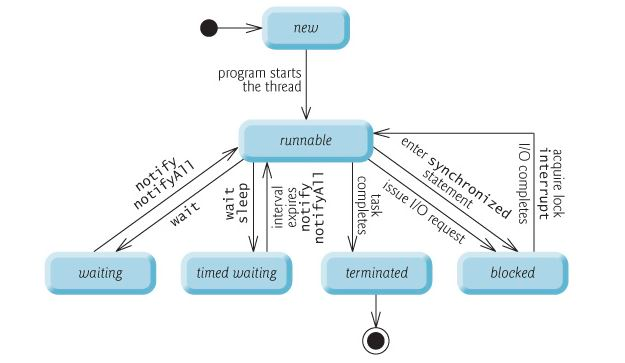

# java 线程生命周期和线程状态

[原文]( https://howtodoinjava.com/Java/multi-threading/Java-thread-life-cycle-and-thread-states/ )  
一个java的线程可以是生命周期中的任意一个状态。比如：New，Runnable，Blocked，Waiting，Time Waiting 或 Terminated

## Java Thread Life Cycle States
  

1. New  
我们新建的线程就是NEW状态的，这个状态会一直保持直到程序中start()方法被调用。
   
2. Runnable  
当我们在程序中调用 `start()` 方法的时候会将对应的线程设置为RUNNABLE状态。此时，线程的执行控制权交给线程调度器。
   由调度器觉得是支持这个线程还是不执行这个进程而去执行其他进程。
   
在大多数操作系统中，每一个线程都会被给予很小的执行时间（叫做量子或者时间片）来执行自己的任务。一个任务利用分配的量子或者时间片的时候就是RUNNING状态。
当他的量子或者时间片过期了，这个线程就会返回到RUNNABLE状态，此时操作系统可以安排其他线程来获得执行权。

操作系统对java虚拟机隐藏了RUNNABLE和RUNNING状态，JAVA虚拟机只能看到RUNNABLE状态。
  

3. Blocked  
   对应"阻塞"状态，此线程需要获得某个锁才能继续执行，而这个锁目前被其他线程持有，所以进入了被动的等待状态，直到抢到了那个锁，才会再次进入"就绪"状态

4. Waiting 
一个线程会因为很多原因而被置为waiting状态。
   比如：wait()方法的调用。通常，一个线程被 `wait()` 是因为要做一些事情，而这些事情的优先级要比现在这个事情高。
   

5. Timed Waiting

A RUNNABLE thread can transition to the TIMED WAITING state if it provides an optional wait interval when it’s waiting for another thread to perform a task. You can put a java thread in TIMED WAITING state by calling it’s sleep(long millis) method or wait(long millis) method.

Such a thread returns to the RUNNABLE state when it’s notified by another thread or when the timed interval expires—whichever comes first.

Timed waiting threads and waiting threads cannot use a processor, even if one is available.

6. Terminated 
   
A thread enters the TERMINATED state (sometimes called the dead state) when it successfully completes its task or otherwise terminated due to any error or even it was forcefully killed.
