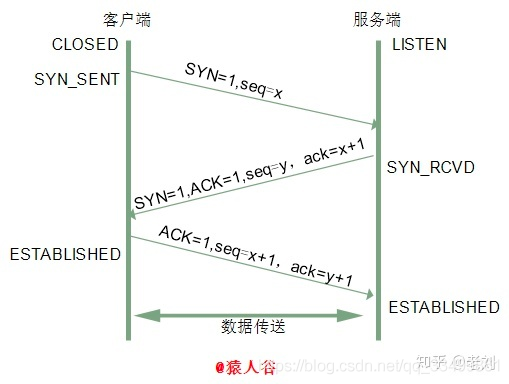
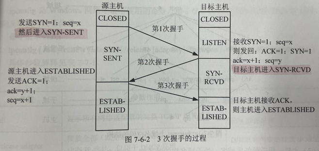

# 美团java后端一二面
从这个[链接]( https://www.nowcoder.com/discuss/714541?channel=-1&source_id=discuss_terminal_discuss_sim_nctrack&ncTraceId=ebcaf5249f0b4939a9ee865b43354242.9716.16520650114365732 )看到的内容，从中进行了摘录，原文是只有问题没有答案的。

## 网络
1. tcp和udp是哪一层的协议？
   
    传输层
   
---
2. tcp的三次握手
   
   三次握手是指建立一个TCP链接时，需要客户端和服务端发送三个数据包的过程。进行三次握手是为了确定双方的接收能力和发送能力是否正常。  
   刚开始客户端处于Closed状态，服务端处于Listen状态。
   
    **第一次握手**  
        源主机发送一个同步标识位SYN=1的TCP数据段。此段中同时标明初始序号（Initial Sequence Number）ISN。
        ISN是一个随时间变化的随机值，即SYN=1，seq=x。源主机进入SYN-SENT状态。
    
    **第二次握手**  
        目标主机接收到SYN包后发回确认数据报文。该数据报文ACK=1,同时确认序号字段表明目标主机期待收到源主机下一个数据段的序号，即ACK=x+1（表明前一个数据段已经收到且没有错误）。  
        此外，在此段中设置SYN=1，并包含目标主机的段初始序号y，即ACK=1，确认序号ack=x+1，SYN=1，自身序号seq=y。此时目标主机进入SYN-RCVD状态（注：大写ACK标识TCP报文首部的ACK位，小写ack和seq标识序号）
    
    **第三次握手**  
        源主机进入ESTABLISHED状态，源主机再回送一个确认数据段，同样带有递增的发送序号和确定序号（ACK=1，确认序号ack=y+1，自身序号seq=x+1）,当目标主机接收到
   源主机确认后，进入ESTABLISHED状态。TCP会话的3次握手完成。接下来，源主机和目标主机可以相互收发数据。
    
---   
3. 如果第一次失败会发生什么？客户和服务端是什么状态？
   当客户端想和服务端建立TCP连接的时候，首先第一个发的就是SYN报文，然后进入SYN_SENT状态。服务端还是CLOSED状态。 
     
   在这之后，如果客户端迟迟收不到服务端的SYN+ACK报文（第二次握手），那么触发超时重传机制。不同版本的操作系统超时时间不同，有的是1s，有的是3s。这个时间是写死在内核中的，几乎不会有人去改。  

   当客户端在1s后没收到服务端的SYN+ACK报文的话，客户端就会重发SYN报文，重试的次数也是有内核中参数控制，一般是5，通常第一次重传是在1s后，第二次是在2s后，第三次是在4s后，以此类推。当第五次重传后，会继续等待32s,如果服务端仍然没响应，则断开TCP连接，所以总耗时为1+2+4+8+16=32=63s。
---
4. 第二次握手丢失，会发生什么
   当服务器收到客户端的第一次握手后，就会回复SYN+ACK报文给客户端，这就是第二次握手，此时服务端进入SYN_REVD状态。

    第二次握手的SYN-ACK报文其实有两个目的  
    1.ack是对第一次握手的确认报文  
    2.syn是服务端发起建立连接的tcp报文  

    所以如果第二次握手丢失了，客户端迟迟没有收到第二次握手的确认报文，所以服务端以为自己的第一次握手的syn报文丢失了，于是客户端会触发上述讲的超时重传机制，重传第一次握手的syn报文。

    因为第二次握手中包含服务端的SYN报文，所以当客户端收到后需要给服务端发送ACK报文(第三次握手),服务端才认为该SYN报文被客户端收到了，那么如果第二次握手丢失了，服务端就收到不到第三次握手的ack报文，于是服务端也会触发超时重传机制，重传SYN-ACK报文。
---
5. 第三次握手丢失，会发生什么  
   客户端收到服务器的SYN-ACK报文后，就会给服务器发送一个ACK报文，也就是第三次握手，此时客户端进入ESTABLISH状态。

    因为第三次握手是对第二次握手的确认报文，所以当第三次握手丢失后，也就是服务端迟迟收不到确认报文，那么会触发服务端的超时重传，即重传SYN-ACK报文，知道第三次握手成功或者达到最大重传次数断开连接。

    注意：ACK报文是不会重传的，当ACK报文丢失，则由对方重传SYN报文

6. 为什么不能四次？  
   [TCP 为什么是三次握手，而不是两次或四次？](https://zhuanlan.zhihu.com/p/455678474)
6. tcp如何进行用塞控制的？
7. 7层协议展开讲讲
8. tcp的报文格式

## redis
+ redis的基本数据结构
+ zset的实现方式
+ 介绍一下跳表
+ 跳表节点晋升机制
+ 随机算法是怎么实现的？

## 死锁是怎么产生的？四个必要条件？锁升级的过程？锁对应linux是什么机制？讲一下volatile？进程间通信方式？线程间通信方式？

## JVM
+ 内存模型有哪些？
+ 垃圾回算法有哪些？
+ G1用的是什么算法

## 数据库
+ 索引的分类
    + 索引是在存储引擎中实现的，也就是说不同的存储引擎，会使用不同的索引。
        + MyIsAM和InnoDB 存储引擎只支持BTREE索引。也就是说默认使用BTREE，不能够更换。
        + MEMORY/HEAP存储引擎：支持HASH和BTREE索引
        
    + Mysql的索引分为三大类：单列索引（普通索引，唯一索引，主键索引），组合索引，全文索引
       + 单列索引
            + 普通索引：Mysql中基本索引类型，没有什么限制，允许在定义索引的列中插入重复值和空值,纯粹为了查询更快。
            + 唯一索引：索引列中的值必须是唯一的，但是允许为空值。
            + 主键索引：是一种特殊的唯一索引，不允许有空值。（主键约束就是一个主键索引）
         
       + **主键索引与唯一索引的区别：**
            1. 主键是一种约束，唯一索引是一种索引，两者在本质上是不同的。
            2. 主键创建后一定包含一个唯一性索引，唯一性索引并不一定是主键。
            3. 唯一索引允许有空值，而主键列不允许为空值。
            4. 主键索引在创建时，已经默认为非空 + 唯一索引了
            5. 一个表最多只能创建一个主键索引，但可以创建多个唯一索引。
            6. 主键更适合那些不容易更改的唯一标识，如自动递增列、身份证号等。
            7. 主键可以被其他表引用为外键，而唯一索引不能。
            
        + 组合索引
          
          在表中的多个字段组合上创建的索引，只有在查询条件中使用了这些字段的左边字段时，索引才会被使用，使用组合索引时遵循最左前缀集合。例如，这里由id、name和age3个字段构成的索引，索引行中就按id/name/age的顺序存放，索引可以索引下面字段组合(id，name，age)、(id，name)或者(id)。如果要查询的字段不构成索引最左面的前缀，那么就不会是用索引，比如，age或者（name，age）组合就不会使用索引查询。
        + 全文索引
          
          全文索引，只有在MyISAM引擎上才能使用，只能在CHAR,VARCHAR,TEXT类型字段上使用全文索引，介绍了要求，说说什么是全文索引，就是在一堆文字中，通过其中的某个关键字等，就能找到该字段所属的记录行，比如有"你是个大煞笔，二货 ..." 通过大煞笔，可能就可以找到该条记录。这里说的是可能，因为全文索引的使用涉及了很多细节，我们只需要知道这个大概意思。一般开发中，不贵用到全文索引，因为其占用很大的物理空间和降低了记录修改性，故较为少用。
---
+ 索引的优缺点：
    1. 优点：创建索引可以大大提高系统的性能。
        + 通过创建唯一性索引，可以保证数据库表中每一行数据的唯一性。
        + 可以大大加快 数据的检索速度，这也是创建索引的最主要的原因。
        + 可以加速表和表之间的连接，特别是在实现数据的参考完整性方面特别有意义。
        + 在使用分组和排序子句进行数据检索时，同样可以显著减少查询中分组和排序的时间。
        + 通过使用索引，可以在查询的过程中，使用优化隐藏器，提高系统的性能。
    2. 缺点： 增加索引有如此多的优点，为什么不对表中的每一个列创建一个索引呢？这是因为，增加索引也有许多不利的一个方面:

       + 创建索引和维护索引要耗费时间，这种时间随着数据量的增加而增加。

       + 索引需要占物理空间，除了数据表占数据空间之外，每一个索引还要占一定的物理空间。如果要建立聚簇索引，那么                    需要的空间就会更大。

       + 当对表中的数据进行增加、删除和修改的时候，索引也要动态的维护，这样就降低了数据的维护速度。
    
---
+ 哪些字段适合作为索引（不适合作为索引）： 
    
  + **一般来说，应该在这些列上创建索引，例如：**
    1. 在经常需要搜索的列上，可以加快搜索的速度；
    2. 在作为主键的列上，强制该列的唯一性和组织表中数据的排列结构；
    3. 在经常用在连接的列上，这些列主要是一些外键，可以加快连接的速度；
    4. 在经常需要根据范围进行搜索的列上创建索引，因为索引已经排序，其指定的范围是连续的；
    5. 在经常需要排序的列上创建索引，因为索引已经排序，这样查询可以利用索引的排序，加快排序查询时间；
    6. 在经常使用在WHERE子句中的列上面创建索引，加快条件的判断速度。
      
  + **什么样的字段不适合创建索引:**
    1. 对于那些在查询中很少使用或者参考的列不应该创建索引。这是因为，既然这些列很少使用到，因此有索引或者无索引，
并不能提高查询速度。相反，由于增加了索引，反而降低了系统的维护速度和增大了空间需求。 
    2. 对于那些只有很少数据值的列也不应该增加索引。这是因为，由于这些列的取值很少，例如人事表的性别列，
在查询的结果中，结果集的数据行占了表中数据行的很大比 例，即需要在表中搜索的数据行的比例很大。
增加索引，并不能明显加快检索速度。
    3. 对于那些定义为text, image和bit数据类型的列不应该增加索引。这是因为，这些列的数据量要么相当大，要么取值很少。
    4. 当修改性能远远大于检索性能时，不应该创建索引。这是因为，修改性能和检索性能是互相矛盾的。
当增加索引时，会提高检索性能，但是会降低修改性能。当减少索引时，会提高修改性能，降低检索性能。
因此，当修改性能远远大于检索性能时，不应该创建索引。

+ 什么是B树，B+树，为什么用B+树
+ 联合索引是什么？
+ 如果建立ABC索引，只对AC做等值查询会走索引吗？会走哪些索引？

## 
